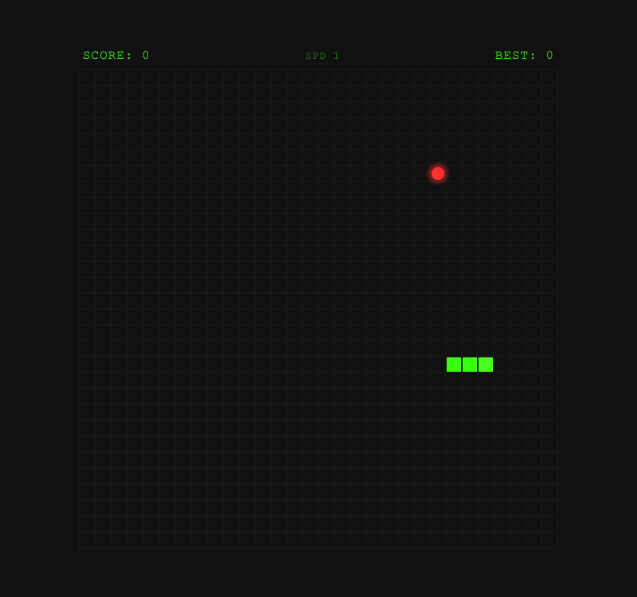

# Snake Reloaded

A browser-based classic snake game with a modern retro aesthetic. Zero dependencies, single file.



---

## How to Play

| Action | Keys |
|--------|------|
| Move up | `W` or `Arrow Up` |
| Move down | `S` or `Arrow Down` |
| Move left | `A` or `Arrow Left` |
| Move right | `D` or `Arrow Right` |
| Start / Restart | `Space` |

---

## Features

- 30x30 grid with 600x600 canvas
- Neon green snake on a dark retro background
- Food with a pulsing glow effect and eat flash
- Score (+10 per food) with persistent high score across sessions
- Speed progression - gets faster every 5 foods eaten (SPD 1 to max)
- "NEW HIGH SCORE!" banner when you beat your best
- Start screen and game over screen with final stats

---

## How to Run

Just open `index.html` in any modern browser - no server, no install, no build step.

```
open index.html
```

---

## Tech Stack

- Vanilla JavaScript
- HTML5 Canvas API
- `setInterval` game loop for discrete step movement
- `requestAnimationFrame` for smooth food glow animation
- `localStorage` for high score persistence

---

## Live Demo

[stonedhawk.github.io/snake-reloaded](https://stonedhawk.github.io/snake-reloaded)

---

## License

MIT
