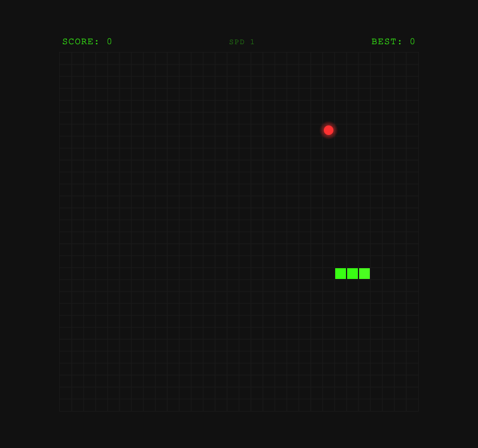
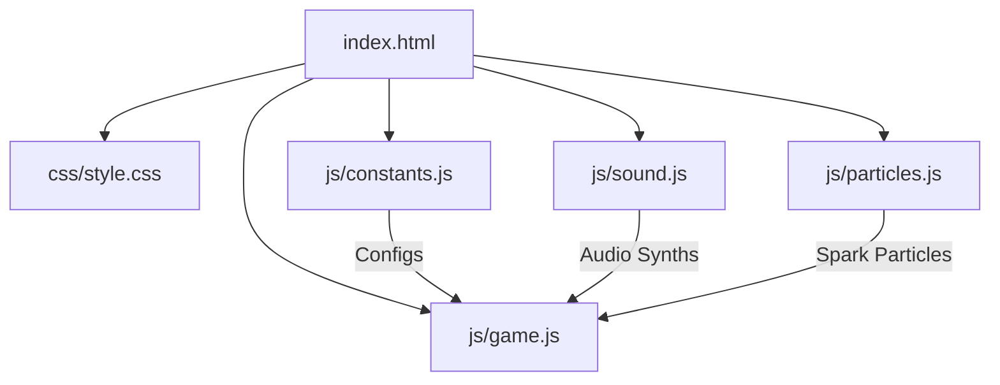

# 🐍 Snake Reloaded

[](LICENSE)
[](https://developer.mozilla.org/en-US/docs/Web/Guide/HTML/HTML5)
[](https://developer.mozilla.org/en-US/docs/Web/CSS)
[](https://developer.mozilla.org/en-US/docs/Web/JavaScript)
[](https://en.wikipedia.org/wiki/Synthwave)

A highly polished, premium browser-based arcade game that reimagines the classic Snake with a modern **retro-futuristic, cyber-neon aesthetic**. Built entirely with **vanilla technologies** (HTML5 Canvas, CSS Grid, and the browser's Web Audio API) with absolutely **zero external dependencies**.

Loaded with kinetic particle feedback, real-time chiptune synthesis, and realistic CRT scanline curvature effects. 

> [!TIP]
> **Play it instantly in your browser!** No compilation, no local servers, and no setups are required. Just double-click the file or open the live demo.

🔗 **[Live Interactive Demo](https://stonedhawk.github.io/snake-reloaded)**

---

## 📸 Arcade Showcase



---

## 🕹️ Controls Guide

Interact using classic arcade keyboard controls:

| Action | Control Keys | Purpose |
| :--- | :--- | :--- |
| **Move Up** | <kbd>W</kbd> or <kbd>▲ Arrow Up</kbd> | Navigate snake upward |
| **Move Down** | <kbd>S</kbd> or <kbd>▼ Arrow Down</kbd> | Navigate snake downward |
| **Move Left** | <kbd>A</kbd> or <kbd>◀ Arrow Left</kbd> | Navigate snake leftward |
| **Move Right** | <kbd>D</kbd> or <kbd>▶ Arrow Right</kbd> | Navigate snake rightward |
| **Start / Replay** | <kbd>SPACEBAR</kbd> | Boots game / triggers replay at Game Over |
| **Pause / Resume** | <kbd>P</kbd> or <kbd>ESC</kbd> | Safely freeze the clock mid-run |

---

## ✨ Features & Polish

### 🎨 Retro-Futuristic Aesthetics
- **CRT Monitor Scanlines**: Subtle horizontal grill overlay and monitor color aberrations coupled with dynamic CRT flickering mimicking real glass monitors. (Fully toggleable!)
- **Cyber-Neon Vector Renderer**: Bright cyber green snake and high-intensity cherry red food drawn with gorgeous radial gradients, realistic drop shadow glows, and smooth rounded corners.
- **Directional Expressions**: The snake head segment renders cute interactive eyes that physically rotate to look in the exact direction of travel.

### 💥 Kinetic Juice
- **Sparks Particle Engine**: Spawning retro particles on food ingestion with randomized initial velocities, friction parameters, gravity vectors, and fading opacities.
- **Background Impact Flash**: Brief visual color flash overlay on the board when eating, yielding instant satisfying action feedback.
- **Tapering Tail Segments**: Tail segments scale down gradually toward the tip of the body, introducing standard modern game design principles to the classic layout.
- **Bonus Golden Fruit**: An occasional **Golden Cherry** spawns at a rare 10% chance, awarding triple points, rich golden sparkles, and unique harmonized sounds.

### 🔊 8-Bit Audio Synthesizer
- Fully driven by the browser's **Web Audio API** (`AudioContext`). Synthesizes NES-style sound effects on-the-fly using square/triangle oscillators and decay filters.
  - **Rising Start Arpeggio**: `C4` ➔ `E4` ➔ `G4` ➔ `C5` chiptune chime.
  - **Eat Blip**: Rising exponential frequency slide.
  - **Level-Up chime**: High-pitch harmonized dual beep.
  - **Game Over Rumble**: Low-frequency sawtooth sweep through a decaying low-pass filter.
  - **Pause Slide**: Fast frequency slide indicating sleep/wakeup modes.
- Sound effects can be dynamically muted using the physical arcade toggle button.

---

## 📂 Modular Architecture

The repository is modularly refactored to optimize file structures while maintaining 100% direct double-click `file://` compatibility inside modern web browsers (bypassing CORS barriers).


```mermaid
graph TD
    A[index.html] --> B[css/style.css]
    A --> C[js/constants.js]
    A --> D[js/sound.js]
    A --> E[js/particles.js]
    A --> F[js/game.js]
    
    C -->|Configs| F
    D -->|Audio Synths| F
    E -->|Spark Particles| F
```

### File Loadout:
- [index.html](file:///Users/rahul.shah/Documents/Antigravity/Snake%20Reloaded/index.html): Clean, semantic HTML5 structure, HUD, and toggle buttons.
- [css/style.css](file:///Users/rahul.shah/Documents/Antigravity/Snake%20Reloaded/css/style.css): Neon variables, glass-morphism panels, mechanical buttons, CRT line overlays.
- [js/constants.js](file:///Users/rahul.shah/Documents/Antigravity/Snake%20Reloaded/js/constants.js): Global parameters, colors, directions, and states.
- [js/sound.js](file:///Users/rahul.shah/Documents/Antigravity/Snake%20Reloaded/js/sound.js): Browser AudioContext sound synthesizer.
- [js/particles.js](file:///Users/rahul.shah/Documents/Antigravity/Snake%20Reloaded/js/particles.js): Class-based 2D particle simulation engine.
- [js/game.js](file:///Users/rahul.shah/Documents/Antigravity/Snake%20Reloaded/js/game.js): Main game loop, responsive keyboard mechanics, stats tracking, and graphics renderer.

---

## 🚀 Quickstart & Development

### Local Execution (No Install)
Simply double-click the [index.html](file:///Users/rahul.shah/Documents/Antigravity/Snake%20Reloaded/index.html) file or open it in Google Chrome, Safari, or Mozilla Firefox.

```bash
# macOS Terminal Command
open index.html
```

### Local Dev Server
If you prefer running inside a sandboxed HTTP server environment, you can spin up a simple server using Python or Node:

```bash
# Using Python 3.x
python3 -m http.server 8000

# Using Node.js (npx)
npx http-server -p 8000
```
Then visit `http://localhost:8000` inside your browser.

---

## 📜 License

This project is licensed under the terms of the [MIT License](LICENSE).
